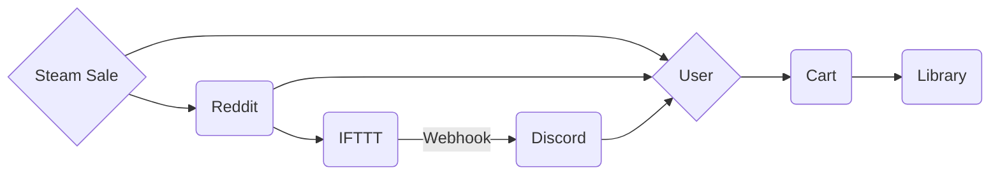
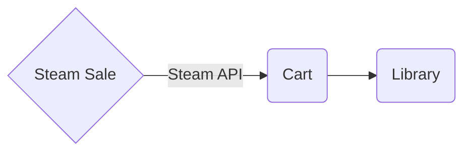

# SteamCurator
The Steam Marketplace is known for placing small to medium-sized game publishers on the back pages of advertisements on steam home. (Even if its a $60 game that is now being offered for $0.00 for a limited time, per the game studio) leaving otherwise unbelievable game deals to go un-noticed. We think this is unacceptable. SteamCurator is a project utilizing steams API's and Pythons flexibility to automatically scan the market for free game deals and 'scoop' games that would otherwise cost anywhere from a cup of coffee to an average fast-food order. Save money and get free games. It's simple.

## Introduction

### How it Works / What we want :
Currently, Our setup consists of utilizing IFTTT to read the Reddit community posts on r/gamedeals and having a webhook post a link to Discord. From there we can click the link and manually add the game to our steam library. 
#### Manual Method
* *Lines added between 'Steam Sale' and 'Reddit' --> 'User' for possibility that User see's game deal by chance of their own and adds game to Library.*

#### Our Method / Application

## Development Discussion_

### Steam API Notes :
> Written with [StackEdit](https://stackedit.io/).
<!--stackedit_data:
eyJoaXN0b3J5IjpbLTEyNDI0MDQ0MV19
-->